# Praktikum Next.js - Jobsheet 2

## 📋 Langkah-Langkah Praktikum

### 1. Pengecekan Lingkungan
- Node v20.20.0
- npm 10.8.2

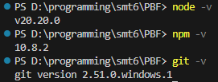

---

### 2. Membuat Project Next.js

---

### 3. Menjalankan Server Development

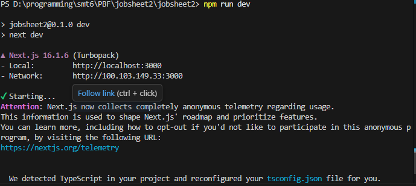
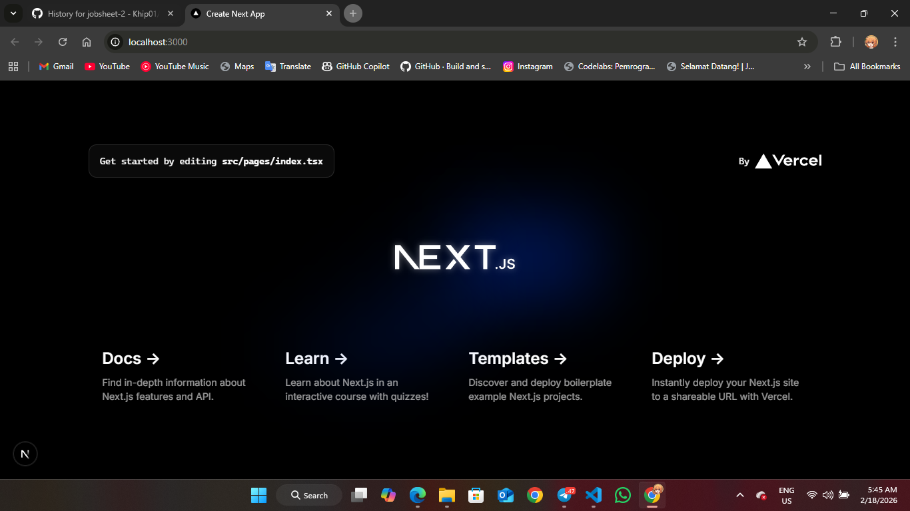

---

### 4. Mengenal Struktur Folder

**Pages**
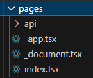

**Public**
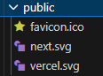

**Styles**
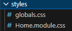

**Package.json**
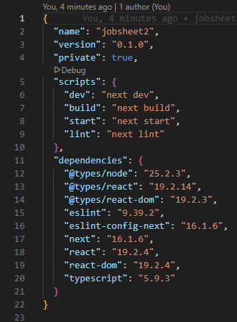

---

### 5. Modifikasi Halaman Utama

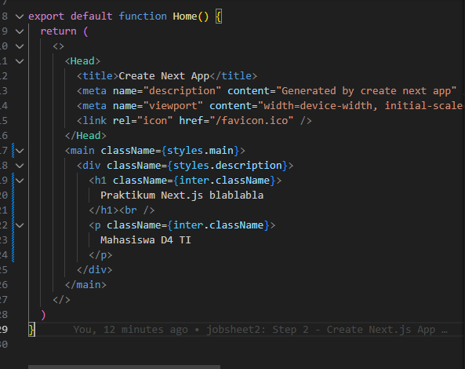
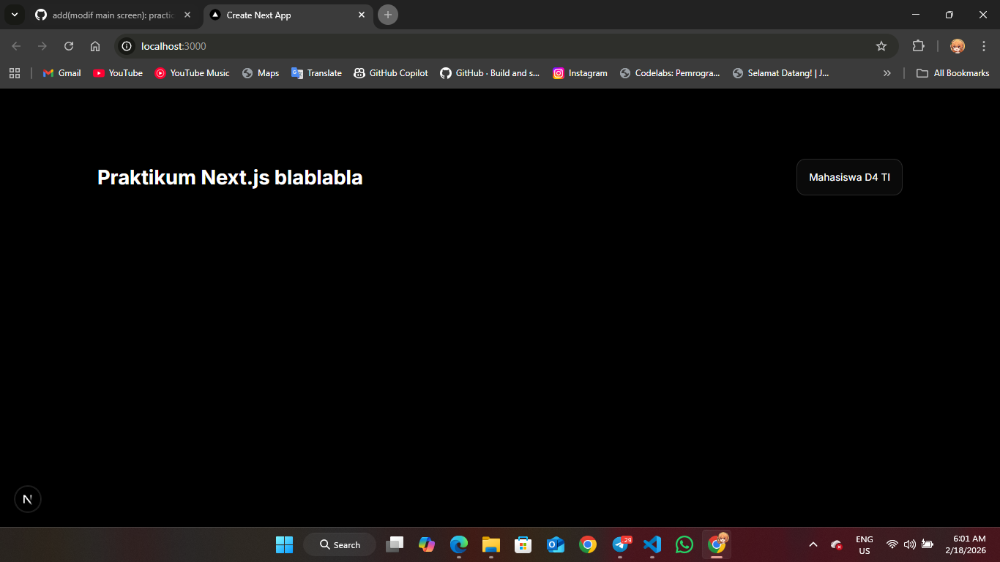

---

### 6. Modifikasi API

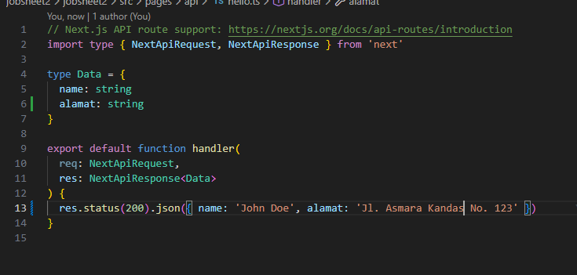
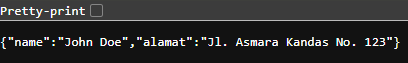
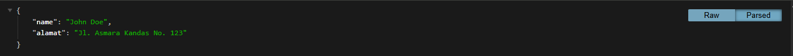

---

### 7. Modifikasi Background

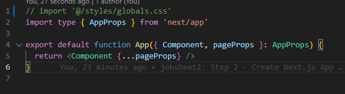
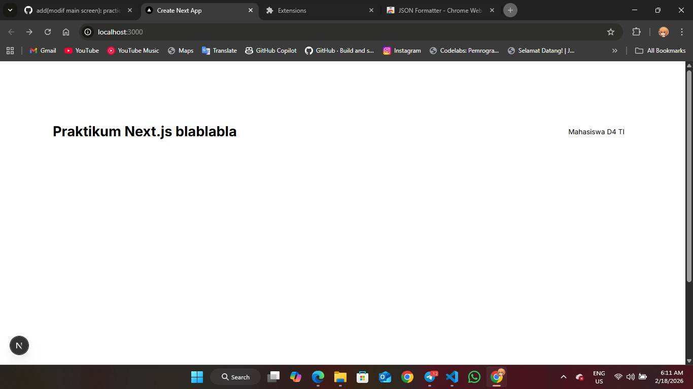

---

## ✅ Tugas

**Tugas 1: Halaman About**

**Tugas 2: Link Navigasi**

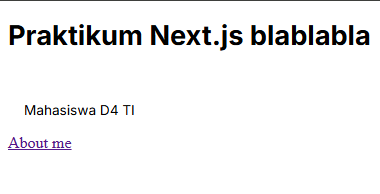

---

## 💭 Pertanyaan Refleksi

### 1. Mengapa Pages Router disebut sebagai routing berbasis file?

Karena struktur folder dan nama file di dalam direktori `pages` secara otomatis menentukan route URL dari aplikasi.

### 2. Apa perbedaan Next.js dengan React standar (CRA)?

**Dari sisi Rendering:**
- **React:** Menggunakan CSR (Client Side Rendering) yang mempersulit SEO karena browser mengambil halaman kosong terlebih dahulu
- **Next.js:** Menggunakan SSR (Server Side Rendering) dimana HTML sudah siap sebelum dikirim ke client

**Dari sisi Routing:**
- **React:** Routing berbasis URL, membutuhkan library tambahan seperti React Router
- **Next.js:** Routing berbasis file, rute halaman sesuai susunan file di direktori `pages`

**Dari sisi Arsitektur:**
- **React:** Library untuk frontend, membutuhkan backend terpisah
- **Next.js:** Framework fullstack yang bisa digunakan untuk frontend dan backend

### 3. Apa fungsi perintah npm run dev?

Menjalankan development server secara lokal dengan kompilasi kode real-time (TypeScript ke JavaScript).

### 4. Apa perbedaan npm run dev dan npm run build?

- **npm run dev** → Untuk proses development
- **npm run build** → Untuk tahap produksi, siap di-deploy