# 📘 Praktikum Next.js — Jobsheet 3

> Materi: Routing, Dynamic Routing, Komponen Navbar, dan Layout Global (App Shell)

---

## 📋 Daftar Isi

- [1. Routing Dasar](#1-routing-dasar-static-routing)
- [2. Routing Menggunakan Folder](#2-routing-menggunakan-folder)
- [3. Nested Routing](#3-nested-routing)
- [4. Dynamic Routing](#4-dynamic-routing)
- [5. Komponen Navbar](#5-membuat-komponen-navbar)
- [6. Layout Global (App Shell)](#6-membuat-layout-global-app-shell)
- [7. Implementasi Layout di _app.tsx](#7-implementasi-layout-di-_apptsx)
- [Tugas](#-tugas)
- [Pertanyaan Refleksi](#-pertanyaan-refleksi)

---

## 1. Routing Dasar (Static Routing)

### a. Tambahkan halaman `about`

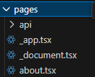

### b. Uji di browser

---

## 2. Routing Menggunakan Folder

### a. Rapikan struktur `pages`

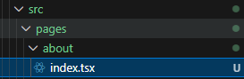

### b. Akses dari browser

---

## 3. Nested Routing

### a. Buat folder `setting`

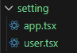

**Modifikasi kode:**

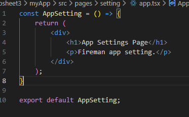
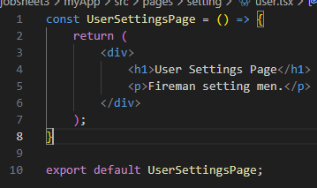

**Akses di browser:**

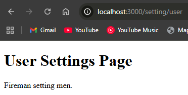
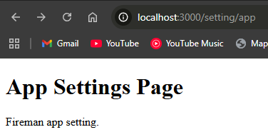

**Modifikasi struktur folder:**

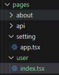
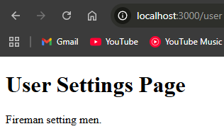

### b. Nested lebih dalam

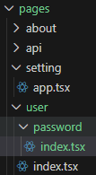

**Akses di browser:**

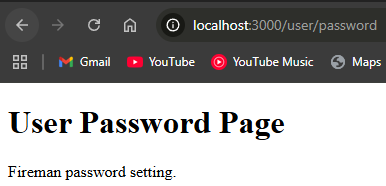

---

## 4. Dynamic Routing

### a. Buat halaman `produk`

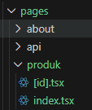

**`index.tsx`:**

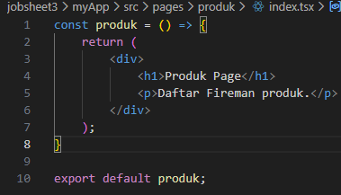

**`[id].tsx`:**

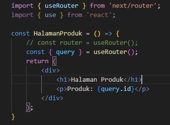
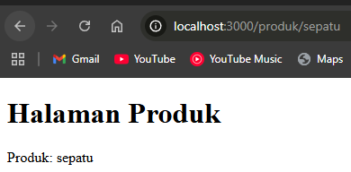
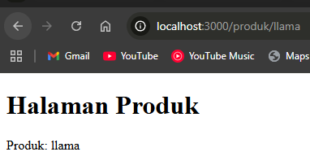

---

## 5. Membuat Komponen Navbar

### a. Struktur komponen

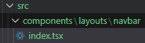

**`index.tsx`:**

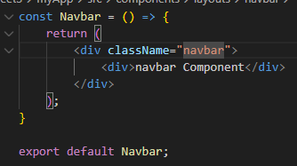

**`globals.css`:**

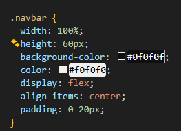

**Hasil:**

### b. Navbar tampil di semua page

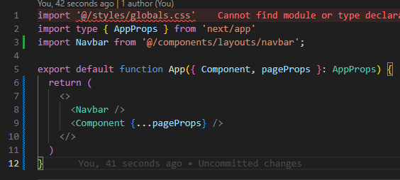

**Hasil:**

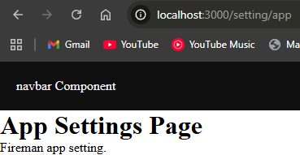

---

## 6. Membuat Layout Global (App Shell)

### a. Buat `AppShell`

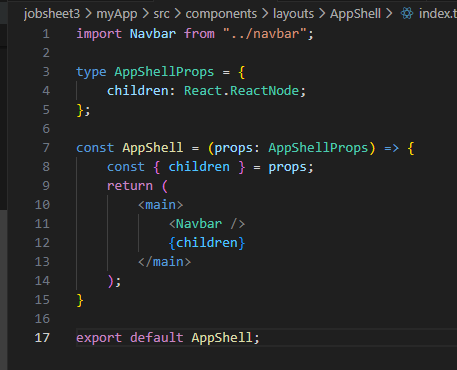

---

## 7. Implementasi Layout di `_app.tsx`

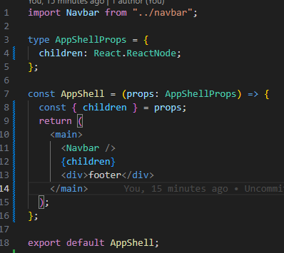
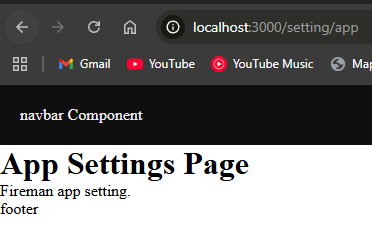

---

## 📝 Tugas

### 1. Routing

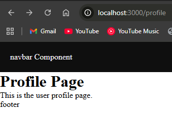
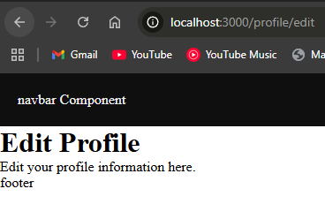

### 2. Dynamic Routing

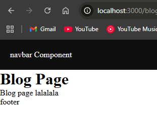
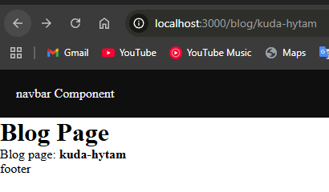

### 3. Footer Layout

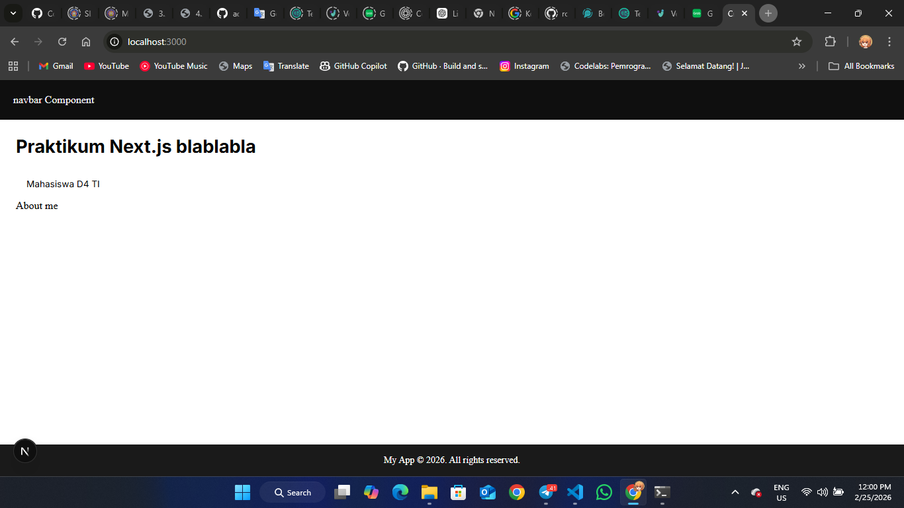
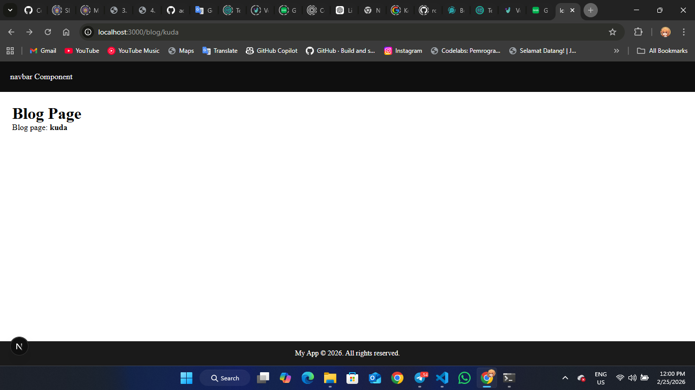

---

## 💬 Pertanyaan Refleksi

### 1. Apa perbedaan routing berbasis file dan routing manual?

Jika **routing berbasis file**, rute ditentukan berdasarkan susunan folder/direktori dan file-nya — cukup buat file di dalam folder `pages`, maka rute otomatis tersedia.

Jika **routing manual**, rute ditentukan secara eksplisit menggunakan kode: menentukan path URL-nya, aturan yang berlaku, serta file mana yang bertanggung jawab menampilkan view untuk URL tersebut.

---

### 2. Mengapa dynamic routing penting dalam aplikasi web?

Dynamic routing memungkinkan satu halaman menangani banyak variasi URL, sehingga bisa digunakan untuk menampilkan data yang berbeda-beda (misalnya detail produk, artikel blog, dsb.) tanpa harus membuat file terpisah untuk setiap halaman.

---

### 3. Apa keuntungan menggunakan layout global dibanding memanggil komponen satu per satu?

Dengan layout global (`AppShell`), perubahan pada komponen seperti `Navbar` atau `Footer` cukup dilakukan di satu tempat saja. Tanpa layout global, setiap perubahan harus direplikasi ke seluruh file halaman secara manual, yang rawan kesalahan dan tidak efisien.