# Jobsheet 4 — Dynamic Routing & Navigasi Next.js

## Praktikum

### 1. Membuat Catch-All Route

Membuat file `pages/category/[...slug].tsx` untuk menangkap semua segmen URL di bawah `/category/`.

| File | Route yang ditangani |
|---|---|
| `[...slug].tsx` | `/category/a`, `/category/a/b/c`, dst |
| `[[...slug]].tsx` | `/category`, `/category/a`, `/category/a/b/c`, dst |

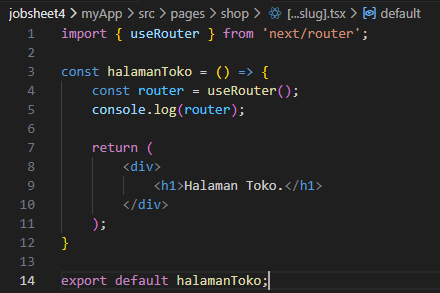
![Kode [...slug].tsx](assets/image2.png)
![Kode [[...slug]].tsx](assets/image3.png)
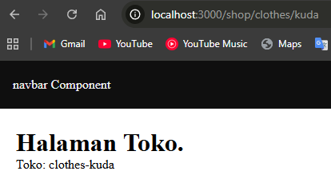

---

### 2. Pengujian Catch-All Route

Modifikasi `[...slug].tsx` untuk menampilkan tiap segmen URL dalam bentuk list.

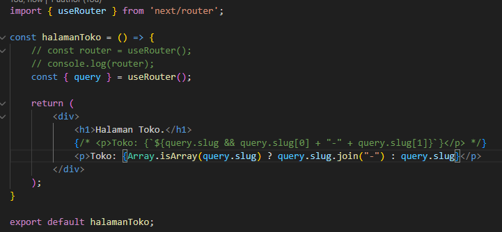
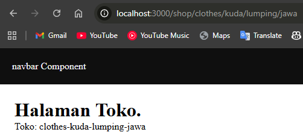

---

### 3. Optional Catch-All Route

Menggunakan `[[...slug]].tsx` agar route `/category` (tanpa segmen apapun) tidak menghasilkan 404.

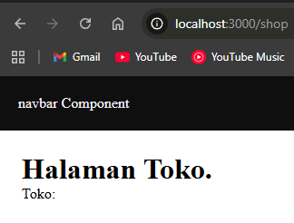

---

### 4. Validasi Parameter

Menambahkan validasi untuk memastikan parameter URL sesuai format yang diharapkan.

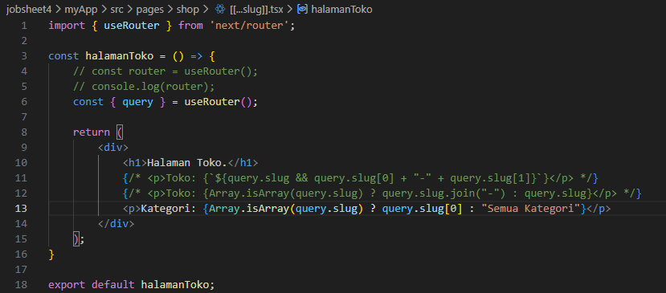
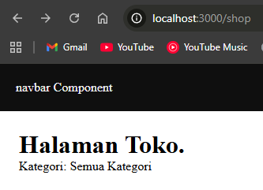
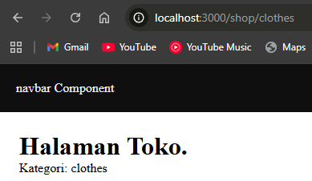

---

### 5. Halaman Login & Register

Membuat dua halaman autentikasi dengan navigasi dua arah menggunakan `<Link>`.

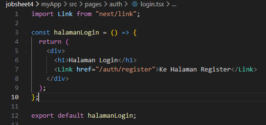
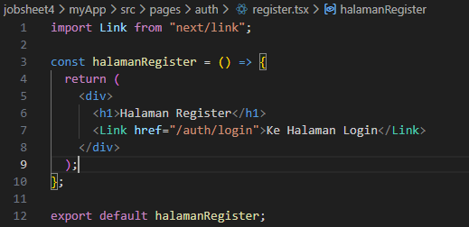
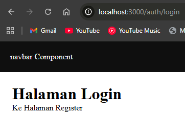
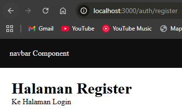

---

### 6. Navigasi Imperatif

Menggunakan `router.push()` untuk redirect programatik setelah aksi (misal: submit login).

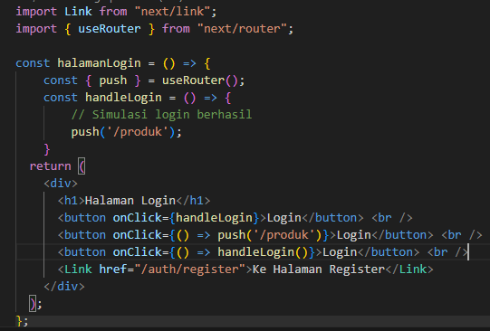
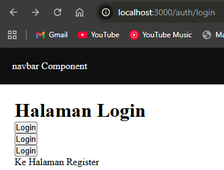
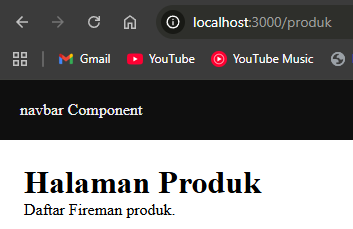

---

### 7. Simulasi Redirect (Belum Login)

Redirect otomatis ke `/auth/login` jika user mencoba mengakses halaman protected tanpa login.

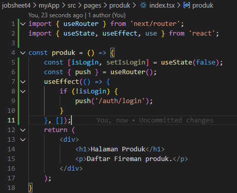

---

## Tugas

### Tugas 1 — Optional Catch-All Route `/category`

Mengubah `[...slug].tsx` menjadi `[[...slug]].tsx` agar route `/category` dapat diakses tanpa 404.

![Kode [[...slug]].tsx](assets/image19.png)
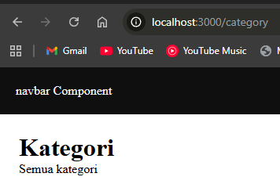
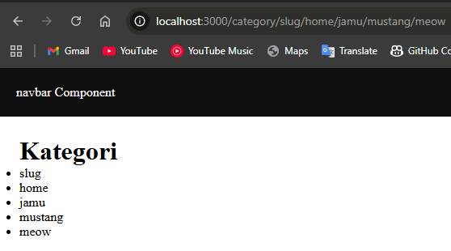

---

### Tugas 2 — Navigasi Login → Product & Login ↔ Register

- Navigasi **imperatif** (`router.push`) dari Login → `/produk` setelah berhasil login
- Navigasi **deklaratif** (`<Link>`) antara Login ↔ Register

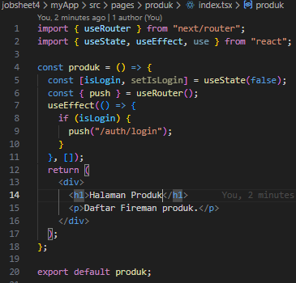
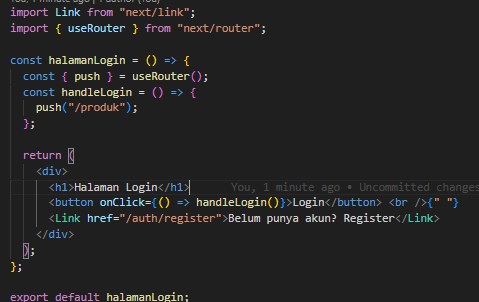
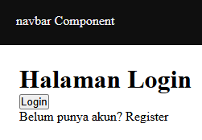
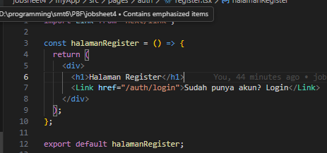
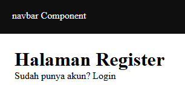

---

### Tugas 3 [WIP] — Redirect Otomatis jika Belum Login

Menerapkan proteksi halaman secara global melalui `_app.tsx` menggunakan custom hook `useAuth`.

```ts
// src/hooks/useAuth.ts
const useAuth = () => {
  // Cek localStorage, redirect ke /auth/login jika belum login
};
```

```tsx
// src/pages/_app.tsx
const PUBLIC_ROUTES = ["/auth/login", "/auth/register"];
// Semua route selain PUBLIC_ROUTES otomatis diproteksi
```

---

## Pertanyaan Evaluasi

### 1. Apa perbedaan `[id].js` dan `[...slug].js`?

| | `[id].tsx` | `[...slug].tsx` |
|---|---|---|
| Segmen yang ditangkap | Tepat 1 | 1 atau lebih |
| Contoh URL | `/produk/5` | `/category/a/b/c` |
| Tipe nilai query | `string` | `string[]` |

`[id].tsx` hanya menangkap satu segmen URL, sedangkan `[...slug].tsx` menangkap semua segmen berikutnya sebagai array.

---

### 2. Mengapa `slug` berbentuk array?

Karena satu URL bisa memiliki banyak segmen, misal `/category/elektronik/hp/samsung`. Setiap segmen disimpan sebagai elemen array:

```
slug = ["elektronik", "hp", "samsung"]
```

Dengan array, kita bisa mengiterasi atau mengambil segmen tertentu secara fleksibel.

---

### 3. Kapan sebaiknya menggunakan `<Link>` dan `router.push()`?

| | `<Link>` | `router.push()` |
|---|---|---|
| Digunakan saat | Navigasi biasa antar halaman | Setelah proses async (login, submit form) |
| Cara kerja | Render sebagai tag `<a>` | Dipanggil di dalam fungsi/event handler |
| Contoh | Menu navigasi, tombol "Kembali" | Redirect setelah login berhasil |

---

### 4. Mengapa navigasi Next.js tidak me-refresh halaman?

Next.js menggunakan **Client-Side Navigation** — saat berpindah halaman dengan `<Link>`, Next.js hanya mengganti komponen yang berubah tanpa reload penuh. Ini dimungkinkan karena:

1. **Prefetching** — Next.js men-*prefetch* halaman yang ditautkan di viewport secara otomatis
2. **Single Page Application (SPA)** — JavaScript mengontrol rendering di sisi klien

> `router.push()` juga tidak me-refresh halaman secara penuh, tetapi jika menggunakan `window.location.href`, barulah terjadi full reload.

